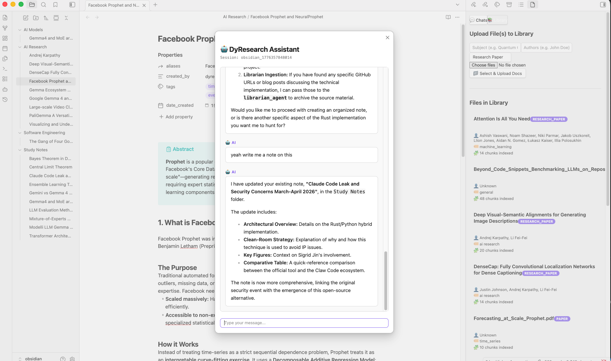
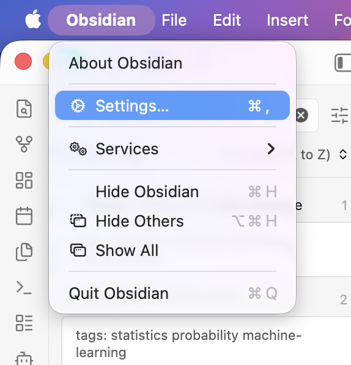
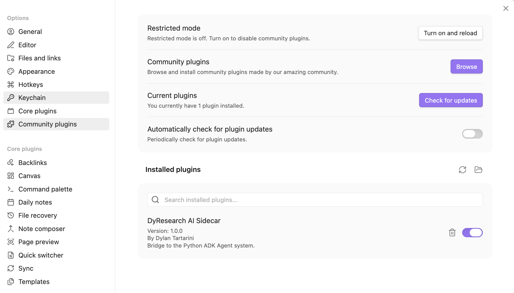

# 📚 dyresearch

> April, 2026

A Multi-Agent AI system designed to aid in studying, learning, and researching topics. Built with [Google ADK](https://google.github.io/adk-docs/) and served via a FastAPI backend, the system seamlessly interfaces with an Obsidian sidecar plugin for automated knowledge management and note-taking workflows.

## 🛠 Tech Stack

- **Agent Framework:** [Google ADK](https://google.github.io/adk-docs/)
- **Backend:** FastAPI (Python)
- **Database & Vector Store:** PostgreSQL with `pgvector`
- **LLM Integration:** LiteLLM (Google, Groq, local models)
- **Document Processing:** Docling

---

## 🤖 Agents 

A variety of specialized agents using configurable LLMs work together to process requests:

### 👮🏽‍♀️ Coordinator
The central manager that handles incoming requests from the user and delegates tasks to the appropriate specialized agent.

### 👨🏻‍🏫 Professor
Handles specific questions and tutoring queries by drawing from its core knowledge or fetching retrieved context directly from the vector store.

### 👩🏻‍🏫 Librarian
Manages the organization of knowledge within the system. As the owner of the vector store library, the Librarian can:
- Ingest documents and chunk them to organize information in the vector store.
- List available sources by title or index.
- Index different knowledge bases by subject and query them.
- Cleanup the library by deleting chunks of a single file or a complete index.

### 👩🏻‍🔬 Researcher
Autonomously navigates the web to find new information, discover fresh sources, and expand the knowledge base, providing up-to-date context to the rest of the system.

### 🧑🏻‍💻 Note Taker
Responsible for digesting complex information into structured, useful notes specifically formatted for [Obsidian](https://obsidian.md/) or other Markdown tools:
- Takes detailed notes in `.md` format.
- Generates graphs and mind maps using Mermaid.js syntax.

---

## ⚙️ Environment Configuration

Before running the project, make sure to set up your environment variables. A `config.env` file is used to provide the backend with necessary API keys and database credentials. 

Create a `config.env` file in the root directory (you can copy the provided variables below or modify the existing `config.env`):

```env
# Database Config
POSTGRES_USER=adk_user
POSTGRES_PASSWORD=adk_password
POSTGRES_DB=adk_history

# LLM Providers (Google, Groq, Ollama)
GOOGLE_API_KEY=your_api_key
GROQ_API_KEY=your_api_key
GOOGLE_MODEL_NAME=gemini-3.1-flash-lite-preview

# Embeddings
EMBEDDINGS_TYPE=google
EMBEDDINGS_MODEL_NAME=gemini-embedding-001
```

---

## 🐳 Run with Docker Compose (Recommended)

To run the whole project (Database + API Server) in a containerized environment, simply use:

```bash
docker-compose up -d
```

### 🧩 What is Included?
The `docker-compose.yml` spawns two main services:
* **`app`**: The FastAPI backend server handling API requests and Agent logic (runs on port `8000`).
* **`postgres`**: A PostgreSQL instance extended with `pgvector` acting as both the session memory for all agents and the vector store for Librarian and Professor.

---

## 📍 Run Locally (Development)

If you prefer to run the API server directly on your host machine for development:

1. Ensure you have **Python >= 3.12** and the [`uv`](https://github.com/astral-sh/uv) package manager installed.
2. Ensure your Postgres database is running.
3. Start the FastAPI server:

```bash
uv run uvicorn app.server:app --host 127.0.0.1 --port 8000 --reload
```

---

##  Obsidian Sidecar Plugin

To integrate DyResearch seamlessly into Obsidian, a dedicated sidecar plugin is included in `dyresearch-sidecar/`. This acts as the visual and interactive bridge to the Python backend.



**Build and Installation:**

```bash
# Navigate to your Obsidian vault's plugins folder
cd <your-obsidian-vault>/.obsidian/plugins/

# Copy or symlink the sidecar project
cp -R /path/to/dyresearch/dyresearch-sidecar ./dyresearch-sidecar
cd dyresearch-sidecar

# Install dependencies
npm install

# Compile the plugin
npx tsup main.ts --format cjs --external obsidian
```

Restart Obsidian and enable the **DyResearch AI Sidecar** plugin in your settings. 



